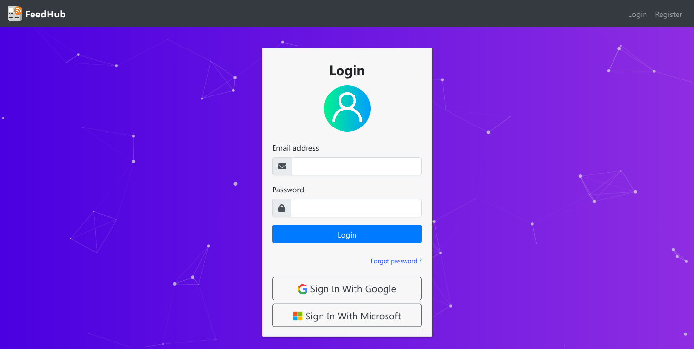
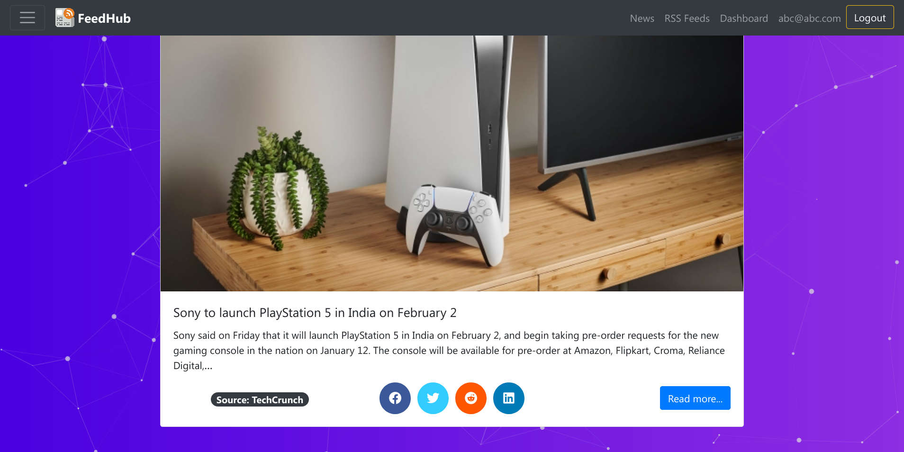
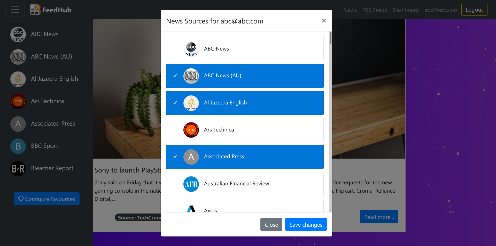
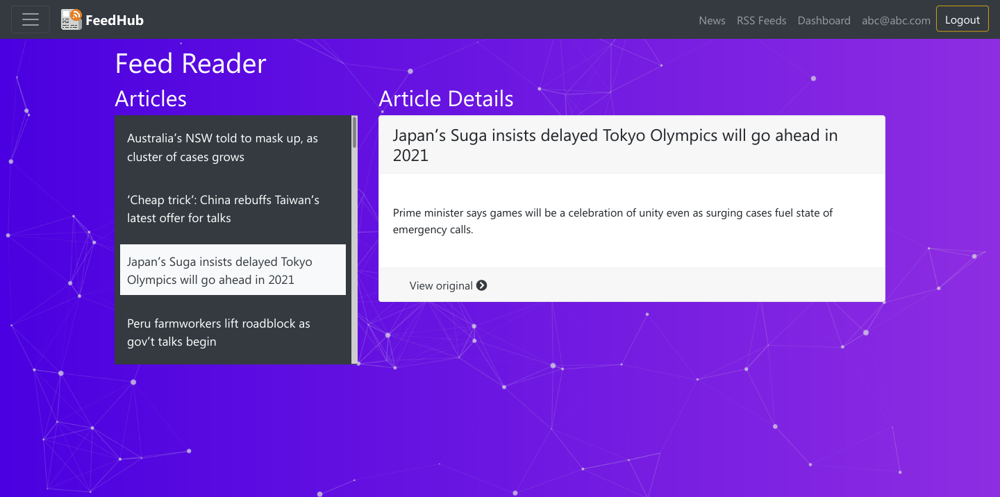

[]()
[](https://github.com/vijethph/FeedHub/issues)
[](https://github.com/vijethph/FeedHub/graphs/contributors)
[](https://github.com/vijethph/FeedHub/network)
[](https://github.com/vijethph/FeedHub/stargazers)
[](https://github.com/vijethph/FeedHub/blob/master/LICENSE)
[](https://reactjs.org)
[](https://forthebadge.com)
[](https://forthebadge.com)

<br />
<p align="center">
  <a href="https://github.com/vijethph/FeedHub">
    
  </a>

  <h2 align="center">FeedHub</h2>

  <p align="center">
    A news aggregator and RSS reader app built with Vue and Firebase.
    <br />
    <br />
    <a href="https://github.com/vijethph/FeedHub/issues">Report Bug</a>
    ·
    <a href="https://github.com/vijethph/FeedHub/issues">Request Feature</a>
  </p>
</p>

<!-- TABLE OF CONTENTS -->

## Table of Contents

- [About the Project](#about-the-project)
  - [Built With](#built-with)
- [Getting Started](#getting-started)
  - [Prerequisites](#prerequisites)
  - [Installation](#installation)
- [Usage](#usage)
- [Contributing](#contributing)
- [License](#license)
- [Contact](#contact)
- [Acknowledgements](#acknowledgements)

<!-- ABOUT THE PROJECT -->

## About The Project

 
 

This is a news aggregator and RSS reader app that uses [Firebase Auth](https://firebase.google.com), [Firestore DB](https://cloud.google.com/firestore), [Vue.js Framework](https://vuejs.org) and [Azure Functions](https://azure.microsoft.com/en-in/services/functions) to fetch news sources and rss feeds, aggregate contents and display them in a user-friendly format. User can authenticate and login with email or Google, view latest news, add and remove favourite news sources, add RSS feeds and subscribe to updates. It also makes use of [NewsAPI](https://newsapi.org) to fetch news from different sources around the world. It fetches and parses RSS feeds with Azure Functions, and is deployed via Firebase Hosting.

### Built With

This project is entirely built with the following components and languages:

- [Firebase Auth](https://firebase.google.com)
- [Firestore Database](https://cloud.google.com/firestore)
- [Vue.js Framework](https://vuejs.org)
- [Azure Functions](https://azure.microsoft.com/en-in/services/functions)
- [NewsAPI](https://newsapi.org)

<!-- GETTING STARTED -->

## Getting Started

Follow these instructions in order to get a copy of the project up and running on your local machine for development and testing purposes.

### Prerequisites

Node.js>=10 should be installed. After installation, check Node.js version using

```sh
node --version
```

You should have a Firebase Account. Log in to [Firebase Console](https://console.firebase.google.com) and create a new project. Add Firebase Credentials to the app in `main.js` file. In Firebase Console, enable authentication with email/password and Google. Create Firestore Database with name as `userfavs`.

### Installation

1. Clone the repo

```git
git clone https://github.com/vijethph/FeedHub.git
```

2. Open the downloaded folder

```sh
cd FeedHub
```

3. Modify the firebaseConfig variable in `main.js` file as per your Firebase project configuration. Sign up for NewsAPI, retrieve an API key, and place it in `News.vue` file inside `src/components` folder. Then import the required dependencies in project folder using

```sh
npm install
```

4. Open up Azure Portal, create an Azure Function with HTTP Trigger, and replace the code in Azure Function with the one present in the file `azurefunction.js`. Get the Function URL and put it in `index.vue` file inside `src/components/feed-reader` folder.

5. Run the program using

```sh
npm run serve
```

The app should be running in `http://localhost:8080` in your browser.

<!-- USAGE EXAMPLES -->

## Usage

Once the app starts, you can create an account in `Register` page, and then login with email/password or Google to find the various features of this project. You can view the latest news, add or remove favourite news sources. You can also add RSS feeds and subscribe to updates.

<!-- CONTRIBUTING -->

## Contributing [](https://github.com/vijethph/FeedHub/pulls)

Contributions are what make the open source community such an amazing place to be learn, inspire, and create. Any contributions you make are **greatly appreciated**.

1. Fork the Project
2. Create your Feature Branch (`git checkout -b feature/AmazingFeature`)
3. Commit your Changes (`git commit -m 'Add some AmazingFeature'`)
4. Push to the Branch (`git push origin feature/AmazingFeature`)
5. Open a Pull Request

<!-- LICENSE -->

## License

Distributed under the MIT License.

<!-- CONTACT -->

## Contact

Vijeth P H - [@vijethph](https://github.com/vijethph)

Sathya M - [@sathya5278](https://github.com/sathya5278)

Project Link: [https://github.com/vijethph/FeedHub](https://github.com/vijethph/FeedHub)

## Thank You!

[](https://forthebadge.com)

If you like this project, please ⭐ this repo and share it with others 👍

<!-- ACKNOWLEDGEMENTS -->

## Acknowledgements

- [Vue.js Framework Docs](https://vuejs.org)
- [Firebase Docs](https://firebase.google.com/docs)
- [Azure Functions Docs](https://docs.microsoft.com/en-us/azure/azure-functions/)
- [NewsAPI Docs](https://newsapi.org/docs)
